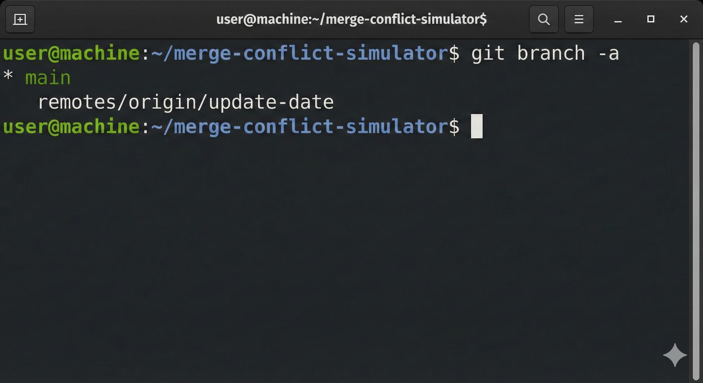
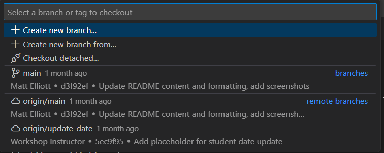
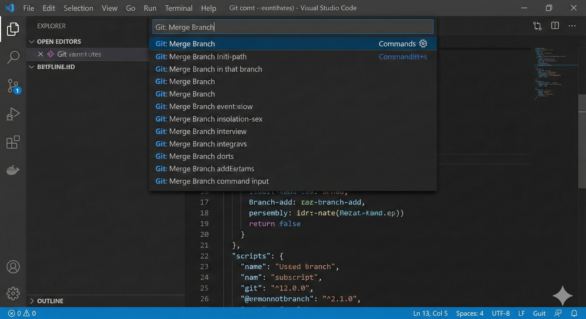
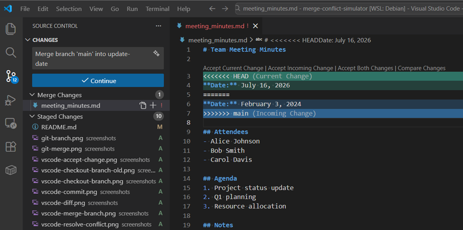
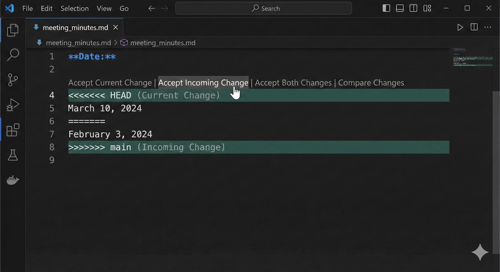
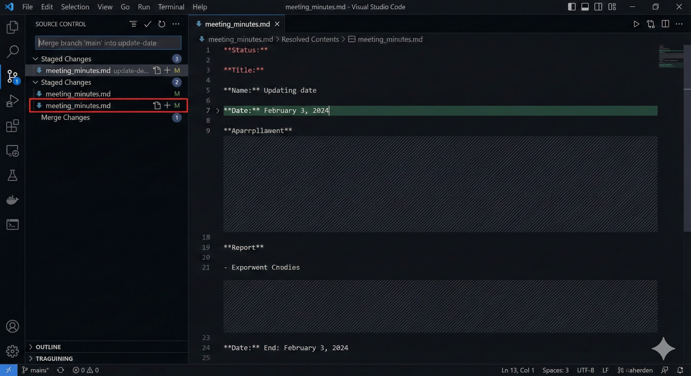
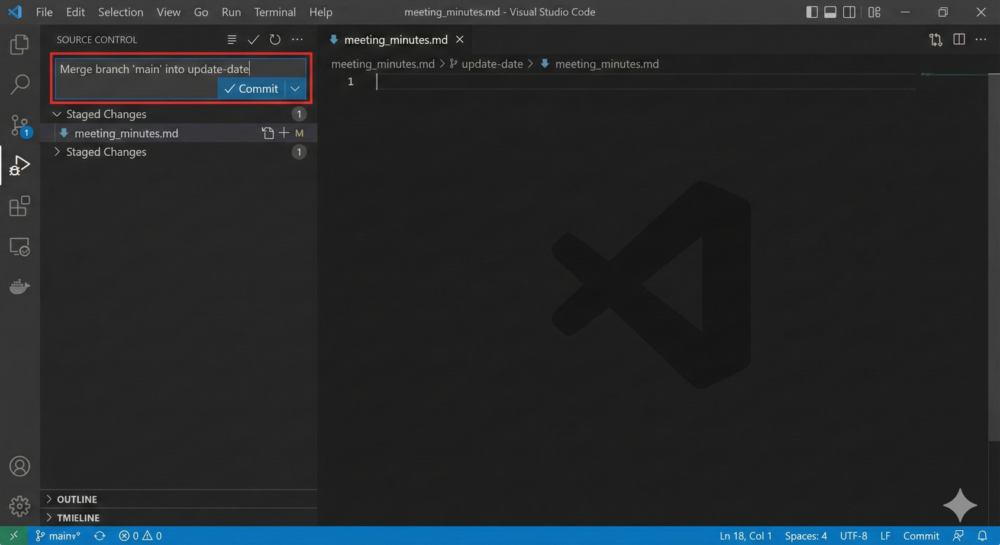
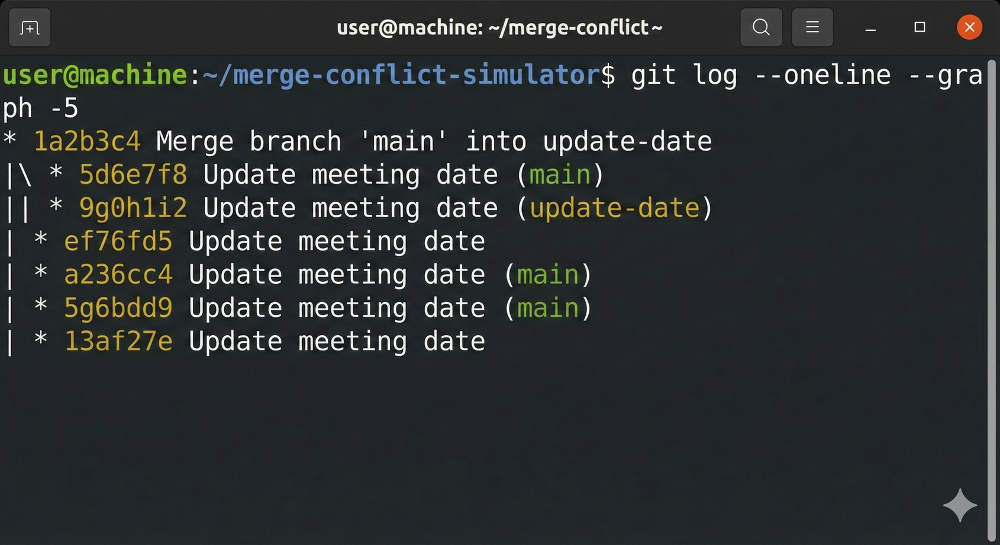

# Merge Conflict Simulator

## Exercise Goal
Learn how to resolve merge conflicts using VS Code's visual conflict resolution tools. This exercise demystifies one of the most feared aspects of Git - merge conflicts!

**What you'll learn:**
- What merge conflicts are and why they happen
- How to identify conflicting changes
- Using VS Code's conflict resolution interface
- Best practices for resolving conflicts safely
- How to complete a merge after resolving conflicts

---

## What Are Merge Conflicts?

A **merge conflict** happens when Git can't automatically combine changes from two different branches because they modify the same part of a file in different ways.

**Think of it like this:** Two people edited the same sentence in a document differently. Git is asking you: "Which version should I keep?"

**The good news:** VS Code makes resolving conflicts visual and straightforward - it's just a series of decisions!

---

## Scenario

Your team maintains meeting minutes. You and a colleague both updated the meeting date, but with different values. Now Git needs your help deciding which date is correct.

---

## Step-by-Step Instructions

### Step 1: Clone the Repository

Using your preferred method:

**Command Line:**

```bash
git clone https://github.com/AMD-melliott/merge-conflict-simulator.git
cd merge-conflict-simulator
```

**Or VS Code:**

1. `Ctrl+Shift+P` / `Cmd+Shift+P` → `Git: Clone`
2. Enter: `https://github.com/AMD-melliott/merge-conflict-simulator.git`
3. Open the cloned folder

---

### Step 2: Understand the Setup

Before we create a conflict, let's see what branches exist.

**In the terminal:**

```bash
git branch -a
```

You should see:

- `main` (your current branch)
- `remotes/origin/update-date` (a branch on GitHub)



**What's happening?** This repository has two branches with conflicting changes already prepared for you.

**Learn more:** [Git Docs: Viewing branches](https://git-scm.com/book/en/v2/Git-Branching-Basic-Branching-and-Merging)

---

### Step 3: Checkout the `update-date` Branch

Let's switch to the branch where you'll be making changes.

**Command Line:**

```bash
git checkout update-date
```

**Or VS Code:**

1. Click the branch name in the bottom-left corner (should say `main`)
2. Select `update-date` from the list



You should see a message: `Switched to branch 'update-date'`

---

### Step 4: Edit the Meeting Date

1. Open `meeting_minutes.md` in VS Code
2. Find the date line near the top:
   ```markdown
   **Date:** January 15, 2024 (PLACEHOLDER - Students will change this)
   ```
3. Change it to a specific date of your choice:
   ```markdown
   **Date:** March 10, 2024
   ```
4. Save the file

**Why we're doing this:** You're simulating a scenario where you made a change to this file on your branch.

---

### Step 5: Commit Your Change

Let's save your date change as a commit.

**Command Line:**

```bash
git add meeting_minutes.md
git commit -m "Update meeting date to March 10, 2024"
```

**Or VS Code:**

1. Open Source Control (`Ctrl+Shift+G` / `Cmd+Shift+G`)
2. Stage `meeting_minutes.md` (click the + icon)
3. Enter commit message: `Update meeting date to March 10, 2024`
4. Click ✓ Commit

---

### Step 6: Try to Merge Changes from `main`

Now comes the important part - we'll try to merge the `main` branch into our current branch. This will trigger the conflict!

**Command Line:**

```bash
git merge main
```

**Or VS Code:**

1. Press `Ctrl+Shift+P` / `Cmd+Shift+P`
2. Type `Git: Merge Branch`
3. Select `main` from the list



---

### Step 7: Encounter the Conflict! 🔥

You should see an error message:

```
Auto-merging meeting_minutes.md
CONFLICT (content): Merge conflict in meeting_minutes.md
Automatic merge failed; fix conflicts and then commit the result.
```

**Don't panic!** This is expected. Git is saying: "I found conflicting changes and need your help."

**In VS Code, you'll see:**
- `meeting_minutes.md` appears in Source Control under **Merge Changes** with a `!` icon
- The file may automatically open showing the conflict


**Learn more:** [GitHub Docs: About merge conflicts](https://docs.github.com/en/pull-requests/collaborating-with-pull-requests/addressing-merge-conflicts/about-merge-conflicts)

---

### Step 8: Open the Conflict in VS Code

If the file didn't open automatically:

1. Go to **Source Control** (`Ctrl+Shift+G` / `Cmd+Shift+G`)
2. Click on `meeting_minutes.md` under **Merge Changes**

You should see the conflict highlighted with special markers:

```markdown
**Date:**

<<<<<<< HEAD (Current Change)
March 10, 2024
=======
February 3, 2024
>>>>>>> main (Incoming Change)
```



**What you're seeing:**

- `<<<<<<< HEAD` - Your change (from the `update-date` branch)
- `=======` - The divider between changes
- `>>>>>>> main` - The change from the `main` branch

**Above the conflict, VS Code shows clickable options:**

- **Accept Current Change** - Keep your date (March 10)
- **Accept Incoming Change** - Use main's date (February 3)
- **Accept Both Changes** - Keep both (usually doesn't make sense for conflicts like this)
- **Compare Changes** - See a side-by-side diff

---

### Step 9: Resolve the Conflict

Now you need to decide which date is correct. Let's say the correct date is **February 3, 2024** (from main).

**Click: "Accept Incoming Change"**



The conflict markers will disappear, and the file will now show:

```markdown
**Date:** February 3, 2024
```

**Alternative methods:**
1. Click **"Accept Current Change"** to keep your version
2. Click **"Compare Changes"** to see a detailed side-by-side comparison
3. Manually edit the file to keep parts of both or write something entirely new

**Important:** You can also manually delete the conflict markers (`<<<<<<<`, `=======`, `>>>>>>>`) and type whatever resolution you want!

**Learn more:** [VS Code Docs: Merge conflicts](https://code.visualstudio.com/docs/sourcecontrol/overview#_merge-conflicts)

---

### Step 10: Review the Resolution

After resolving the conflict:

1. The file should no longer show conflict markers
2. In **Source Control**, `meeting_minutes.md` should move from **Merge Changes** to **Staged Changes**
3. Review the file to make sure it looks correct



**Tip:** Open the file and read through it to ensure the resolution makes sense. Don't just click buttons - understand what you're keeping!

---

### Step 11: Commit the Merge

Now that the conflict is resolved, complete the merge with a commit.

**Command Line:**
```bash
git add meeting_minutes.md
git commit -m "Merge main into update-date, resolve date conflict"
```

**Or VS Code:**
1. The file should already be staged
2. VS Code may pre-fill a merge commit message
3. You can edit it or keep the default: `Merge branch 'main' into update-date`
4. Click ✓ Commit



**Congratulations!** You've successfully resolved your first merge conflict! 🎉

---

### Step 12: Verify the Merge

Let's confirm everything worked:

**Command Line:**
```bash
git log --oneline --graph -5
```

You should see a merge commit connecting the two branches.



**In VS Code:** Check the Timeline view (right-click `meeting_minutes.md` → Open Timeline) to see the merge in the file's history.

---

## Key Takeaways

✅ **Merge conflicts are normal** - They happen when multiple people edit the same code
✅ **VS Code makes conflicts visual** - No need to manually parse conflict markers
✅ **You're in control** - Git doesn't guess; it asks you to decide
✅ **Always review your resolution** - Make sure the final result makes logical sense
✅ **Conflicts are just decisions** - Current Change vs Incoming Change vs Custom

---

## Common Conflict Resolution Strategies

### When to "Accept Current Change"

- Your version is more recent or correct
- You're confident in your changes
- The incoming change is outdated

### When to "Accept Incoming Change"

- The main branch has the authoritative version
- You realize your change was incorrect
- You're updating your branch to match main

### When to "Accept Both Changes"

- Both changes add different things (e.g., two new list items)
- The changes don't contradict each other
- You need content from both sides

### When to Manually Edit

- You need parts of both versions
- Neither version is completely correct
- You need to write a compromise solution

---

## Bonus Challenges

### Challenge 1: Create Your Own Conflict

1. Create a new branch from main
2. Edit the **Next Meeting** date in `meeting_minutes.md`
3. Commit your change
4. Switch back to main and edit the same line differently
5. Commit that change
6. Try to merge your branch into main
7. Resolve the conflict!

### Challenge 2: Resolve a Multi-Line Conflict

1. Edit multiple lines in `meeting_minutes.md` on a branch
2. Edit the same lines differently on main
3. Merge and resolve - what happens when conflicts span multiple lines?

### Challenge 3: Use the 3-Way Merge Editor

1. In VS Code settings, search for "merge editor"
2. Enable "Git: Merge Editor"
3. Next conflict: Try the new 3-way merge view!

**Learn more:** [VS Code 3-Way Merge Editor](https://code.visualstudio.com/docs/sourcecontrol/overview#_3way-merge-editor)

---

## Troubleshooting

### "I accidentally accepted the wrong change"

- Don't commit yet! Just re-open the file and edit it
- Or: `git merge --abort` to cancel the merge entirely

### "I can't see the conflict resolution buttons"

- Make sure you're using a recent version of VS Code
- Try clicking on the file in Source Control to open it
- The buttons appear above the `<<<<<<< HEAD` line

### "I committed but want to undo the merge"

- `git reset --hard HEAD~1` - ⚠️ Warning: This deletes your merge commit
- Or create a new branch and try again: `git checkout -b try-again`

### "The merge seems stuck"

- Check Source Control for unresolved files
- Run `git status` to see what's pending
- You must resolve ALL conflicts before committing

---

## Understanding Merge Conflict Prevention

**How to reduce conflicts:**

1. **Pull frequently** - Stay up to date with main

   ```bash
   git pull origin main
   ```

2. **Communicate with your team** - Know who's editing what

3. **Keep changes small** - Smaller PRs = fewer conflicts

4. **Use feature branches** - Isolate work until it's ready

5. **Resolve conflicts early** - Don't let branches diverge too much

**Learn more:** [Git Best Practices](https://www.git-scm.com/book/en/v2/Git-Branching-Basic-Branching-and-Merging)

---

## Additional Resources

- [GitHub Skills: Resolve merge conflicts](https://github.com/skills/resolve-merge-conflicts)
- [Atlassian: Merge conflicts tutorial](https://www.atlassian.com/git/tutorials/using-branches/merge-conflicts)
- [VS Code Source Control Documentation](https://code.visualstudio.com/docs/sourcecontrol/overview)
- [Git Branching and Merging](https://git-scm.com/book/en/v2/Git-Branching-Basic-Branching-and-Merging)

---

## Real-World Application

In professional development:
- Conflicts happen daily in active projects
- Teams review conflict resolutions in PRs
- Good communication prevents most conflicts
- Tools like VS Code make resolution straightforward

**You now have the skills to handle one of Git's most intimidating features!**

---

**Next Exercise:** [Release Notes Compiler](https://github.com/AMD-melliott/release-notes-compiler) - Learn split-view editing and Markdown preview!
